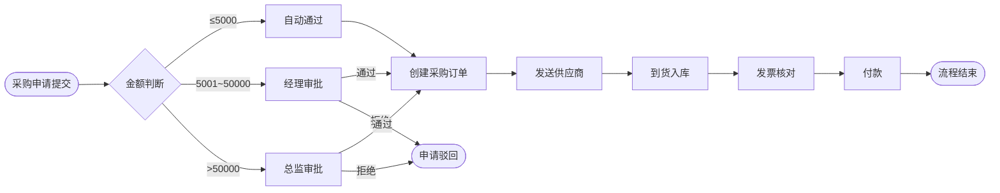

# BPMN 2.0

> 状态: **已细化** | 版本: v0.3.0 | 创建: 2026-02-15 | 更新: 2026-02-18

## 定位

业务流程建模标准（Layer 2）。描述端到端业务流程、跨部门/跨角色协作、审批流程。工具：**draw.io**（免费）。Phase 1 主导，Phase 2~3 持续维护。

---

## 本项目使用范围

BPMN 2.0 标准有 100+ 种元素。本项目渐进使用：

### L1 初始子集（Phase 1 使用）

最核心的 10 个元素，能画清楚 80% 的业务流程：

**事件**（Events）

| 元素 | 符号 | 用途 | 示例 |
|------|------|------|------|
| 开始事件 | 细线圆圈 | 流程的起点 | 收到采购申请 |
| 结束事件 | 粗线圆圈 | 流程的终点 | 采购入库完成 |

**活动**（Activities）

| 元素 | 符号 | 用途 | 示例 |
|------|------|------|------|
| 任务 | 圆角矩形 | 一个具体操作步骤 | 创建采购订单 |
| 用户任务 | 圆角矩形+人图标 | 需要人操作的步骤 | 经理审批 |

**网关**（Gateways）

| 元素 | 符号 | 用途 | 示例 |
|------|------|------|------|
| 排他网关 | 菱形+X | 二选一/多选一分支 | 金额>5000? |
| 并行网关 | 菱形+加号 | 同时执行多个分支 | 同时通知仓库和财务 |

**泳道**（Swim Lanes）

| 元素 | 用途 | 示例 |
|------|------|------|
| 池（Pool） | 一个组织或系统 | 本公司 / 供应商 |
| 道（Lane） | 池内的角色/部门 | 采购部 / 财务部 / 仓库 |

**连接**

| 元素 | 用途 |
|------|------|
| 顺序流（实线箭头） | 步骤之间的执行顺序 |
| 消息流（虚线箭头） | 不同池之间的消息传递 |

### L2 成长子集（Phase 2 补充）

- 中间事件（定时器、消息、信号）
- 子流程（折叠/展开）
- 消息流和数据对象
- 条件表达式标注
- 补偿事件和错误事件

### L3 成熟子集（Phase 3+）

- 事件子流程
- 多实例任务
- 会话（Conversation）
- 编排（Choreography）

---

## draw.io BPMN 使用规范

### 打开 BPMN 模板

```
draw.io → 新建 → 搜索 "BPMN" → 选择 BPMN 2.0 模板
或：左侧形状库 → 搜索 "BPMN" → 添加 BPMN 2.0 形状库
```

### 绘制规范

1. **从左到右**绘制流程（开始事件在左，结束事件在右）
2. **泳道从上到下**按角色层级排列（管理层在上，操作层在下）
3. **每个流程**有且只有 1 个开始事件，可以有多个结束事件
4. **排他网关**必须标注条件文字（如"金额>5000"）
5. **任务命名**使用"动词+名词"格式（如"创建采购订单"、"审批通过"）

### 文件管理

- 源文件：`models/bpmn/{模块}-{流程名}.drawio`
- 导出图：`models/exports/bpmn/{模块}-{流程名}.png`
- 提交信息：`model(bpmn): 新增/更新 {流程名}`

---

## 本项目需要建模的业务流程清单

### Phase 1 必须完成

| 模块 | 流程名 | 文件名 | 涉及角色 | 优先级 |
|------|--------|--------|---------|--------|
| 采购 | 采购全流程 | purchase-process.drawio | 采购员/经理/仓库/财务 | 高 |
| 销售 | 销售全流程 | sale-process.drawio | 销售员/经理/仓库/财务 | 高 |
| 库存 | 出入库流程 | stock-inout-process.drawio | 仓库员/仓库经理 | 高 |
| 财务 | 应收应付流程 | finance-ar-ap-process.drawio | 会计/财务经理 | 中 |
| 通用 | 多级审批流程 | approval-process.drawio | 申请人/经理/总监 | 高 |

### Phase 2 按 Sprint 补充

- 每个 Sprint 交付的模块，需同步更新或新增对应的 BPMN 流程图
- 详细流程在实际开发时基于 Phase 1 的全流程图细化

---

## 示例：采购审批流程（Mermaid 草稿）

> 以下为 AI 生成的 Mermaid 草稿，正式版需在 draw.io 中绘制 BPMN 图。



> 此草稿仅供参考逻辑，正式 BPMN 模型需要：
> - 添加泳道（采购部/审批人/仓库/财务/供应商）
> - 补充异常分支（超时、退货、部分到货）
> - 使用标准 BPMN 2.0 元素

---

## BPMN → Odoo 映射关系（实战经验）

| BPMN 元素 | Odoo 实现方式 | 示例 |
|-----------|-------------|------|
| 用户任务 (User Task) | `action_` 方法 + 按钮 | `action_submit_approval()` |
| 排他网关 (Exclusive Gateway) | `if/else` 条件或 Selection 状态机 | 金额阈值判断走部门经理/总经理审批 |
| 泳道 (Pool/Lane) | Odoo 安全组 (`res.groups`) | 采购员 / 采购经理 / 总经理 |
| 消息事件 (Message Event) | `mail.thread` + `message_post` | 审批通过后通知申请人 |
| 定时事件 (Timer Event) | `ir.cron` 定时任务 | 每月自动触发供应商评分计算 |
| 子流程 (Sub-process) | 独立方法或独立模型 | 收货子流程 = `stock.picking` 操作 |

**1 人 + AI 模式建议**：
- Phase 1 用 Mermaid 出初稿（AI 生成速度快，修改成本低）
- 确需正式交付时再转 draw.io BPMN 2.0
- 开发阶段直接从 Mermaid 图映射到 Odoo 代码，跳过 draw.io 中间步骤

## 待填充内容

- [ ] L2/L3 元素的详细使用指南（按需补充）
- [ ] draw.io BPMN 操作技巧

## 与其他文档的关系

- **上游**：[03-建模体系 README](./README.md)
- **业务输入**：Phase 1 业务调研
- **Odoo 映射**：[Odoo 设计模式](../../01-方法/odoo-patterns.md)（BPMN 流程 → Odoo 状态机实现）
- **模型存储**：`models/bpmn/`

---

## 变更记录

| 版本 | 日期 | 修改内容 |
|------|------|---------|
| v0.1.0 | 2026-02-15 | 占位创建 |
| v0.2.0 | 2026-02-15 | 填充 L1/L2/L3 元素清单、draw.io 规范、流程清单、采购示例 |
| v0.3.0 | 2026-02-18 | 新增 BPMN→Odoo 映射表、1 人 + AI 模式建议 |
